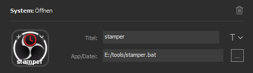

# OBSStamper


A little tool which writes timestamps of a obs recording into a text file.

## Installation

The OBSStamper talks via Websockets to OBS. Since OBS dont have a native interface the [OBS Websocket Plugin](https://github.com/Palakis/obs-websocket) needs to be installed. To do
so goto the [Releases page of the plugin](https://github.com/Palakis/obs-websocket/releases) and follow the instructions for your system.

Additionally **Java >= 8** needs to be installed on your system.

If you use the OBSStamper with the Stream Deck or any other similar software on Windows, download the latest `OBSStamper-Streamdeck.zip`
archive from the [Release page](https://github.com/Poeschl/ObsStamper/releases). More about the setup in the following section.

If you want to use the pure java artefact on Linux or Mac read the Jar section below.

## Use with Stream Deck

Included in the archive is an icon for your configuration and also a bat file.

1. Extract the whole content of the zip to a location of your liking.
2. Set your own password from the OBS websocket settings inside of the `.bat` file (right click -> edit).
3. Add a new item to your Streamdeck with the "Launch" type.
4. Set the icon and name
5. Select the downloaded and edited `.bat` file as App/file.

It should now look similar to:



Now the OBSStamper will create new files in this directory when a stream is running or a record is ongoing and the key is pressed.

## Execute the jar

By executing the jar directly it can be configured more precisely. You can also change the command in the `.bat` file if you like. Everytime you run the OBSStamper with the command
below, it will write the current timestamp of the recording into a text file.

```shell
java -jar path/from/install/OBSStamper-1.0.0.jar -f path/to/textfileparent -p MySuperSecretPassword
```

With `-f` the parent folder for the generated text files can be set. Inside it the files will be named with the start time of the record or stream.

The parameter `-p` sets a password for a secured connection to the websocket plugin. Make sure it is matching the one you specified in the plugin settings.

The full list of parameter is shown with `--help`!
